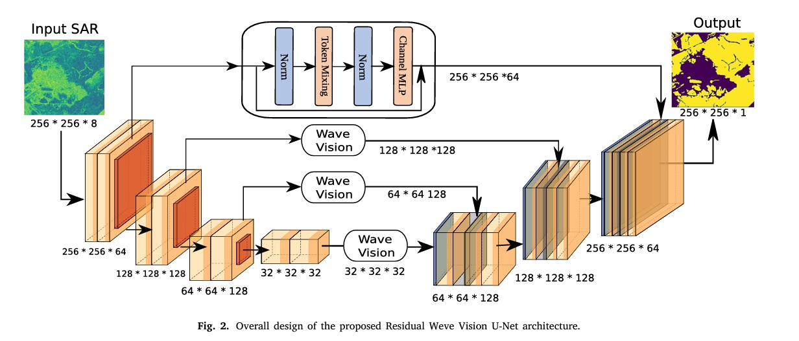
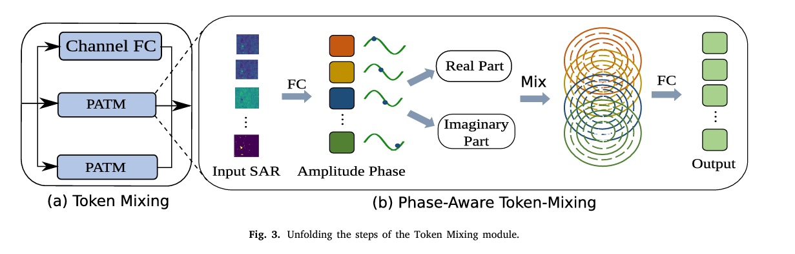

# Residual wave vision U-Net for flood mapping using dual polarization Sentinel-1 SAR imagery☆

[Ali Jamali](https://www.researchgate.net/profile/Ali-Jamali), [Swalpa Kumar Roy](https://swalpa.github.io), [Leila Hashemi Beni](https://www.ncat.edu/employee-bio.php?directoryID=1901247546), [Biswajeet Pradhan](https://profiles.uts.edu.au/Biswajeet.Pradhan), [Jonathan Li](https://uwaterloo.ca/geography-environmental-management/people-profiles/jonathan-li), and [Pedram Ghamisi](https://www.iarai.ac.at/people/pedramghamisi/)

___________

Citation
---------------------

**Please kindly cite the paper if this code is useful and helpful for your research.**

       @article{JAMALI2024103662,
               title = {Residual wave vision U-Net for flood mapping using dual polarization Sentinel-1 SAR imagery},
               author = {Ali Jamali and Swalpa Kumar Roy and Leila {Hashemi Beni} and Biswajeet Pradhan and Jonathan Li and Pedram Ghamisi},
               journal = {International Journal of Applied Earth Observation and Geoinformation},
               volume = {127},
               pages = {103662},
               year = {2024},
               issn = {1569-8432},
               doi = {https://doi.org/10.1016/j.jag.2024.103662},
               url = {https://www.sciencedirect.com/science/article/pii/S1569843224000165},
              }

Acknowledgement
---------------------
 Wave Vision MLP is adopted from (https://github.com/huawei-noah/Efficient-AI-Backbones/tree/master/wavemlp_pytorch).

## License

Copyright (c) 2023 Ali Jamali. Released under the MIT License. See [LICENSE](LICENSE) for details.
